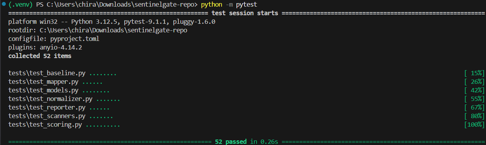

# SentinelGate

A CI/CD security gate that plugs into GitHub Actions, runs multiple security
scanners on every pull request, aggregates and de-duplicates findings, maps
them to OWASP Top 10 / CWE, scores severity, and fails the build if anything
critical slips through — then posts one readable, triaged report as a PR
comment instead of a wall of raw tool output.

## Why this exists

Security tooling that isn't usable gets disabled. A gate that fails on every
PR because of pre-existing tech debt gets an `if: false` added to it within
a week. SentinelGate's core design decision is **baseline diffing**: it only
ever blocks a merge on findings *newly introduced by that PR*, never on
issues that were already in the codebase.

## Test Results

SentinelGate includes a comprehensive automated test suite covering the data model, OWASP/CWE mapping, scanner wrappers, normalization, risk scoring, baseline diffing, and report generation.

**52/52 tests passing**



## Architecture

```
Pull Request opened/updated
        │
        ▼
[GitHub Action trigger] — .github/workflows/sentinelgate.yml
        │
        ▼
┌─────────────────────────────────────────────┐
│              Scanner Orchestrator             │
│  runs scanners independently, normalizes out. │
├───────────────┬───────────────┬───────────────┤
│  SAST          │  Secrets       │  Dependencies  │
│  Semgrep        │  detect-secrets│  pip-audit /   │
│  (bundled       │                │  npm audit     │
│  taint rules)   │                │  (live CVEs)   │
└───────────────┴───────────────┴───────────────┘
        │
        ▼
[Normalizer + Dedup Engine]   — sentinelgate/normalizer.py
        │
        ▼
[Risk Scoring Engine]          — sentinelgate/scoring.py
        │
        ▼
[Baseline Diffing (SQLite)]    — sentinelgate/baseline.py
        │
   ┌────┴────┐
   ▼         ▼
[PR Comment] [Gate Decision]
 reporter.py  exit code 1 on new
              critical/high finding
```

## Install

```bash
git clone https://github.com/Chiiraag11/sentinelgate.git
cd sentinelgate
pip install -e .
```

## CLI usage (works standalone, no GitHub Actions required)

```bash
# Scan a directory
sentinelgate scan .

# Fail only on critical findings
sentinelgate scan . --fail-on critical

# Save the current findings as the baseline for main
sentinelgate baseline-save . --branch main

# Scan a PR branch, only blocking on NEW findings vs. main
sentinelgate scan . --baseline-branch main

# Write out JSON + markdown, and post as a PR comment
sentinelgate scan . \
  --baseline-branch main \
  --json-out findings.json \
  --markdown-out report.md \
  --post-pr your-org/your-repo#42
```

`GITHUB_TOKEN` must be set in the environment for `--post-pr`.

## GitHub Action usage

```yaml
- uses: Chiiraag11/sentinelgate@v1
  with:
    target-dir: "."
    fail-on: high
    baseline-branch: main
```

See `.github/workflows/sentinelgate.yml` for a full example, including
saving a baseline on every push to `main` and diffing PRs against it.

## Scanners

| Category   | Engine                    | Why |
|------------|----------------------------|-----|
| SAST       | Semgrep (bundled ruleset) | Ships its own OWASP-mapped taint-mode rules (`sentinelgate/rules/`) rather than depending on `--config auto`, which requires reaching Semgrep's registry — many CI runners block that outright. |
| Secrets    | detect-secrets            | Pure-Python, pip-installable, no extra binary in the CI image. `GitleaksScanner` is included as a drop-in alternative if you'd rather ship the Go binary. |
| Dependencies | pip-audit / npm audit    | Live CVE lookups against PyPI/npm advisory databases. |

Each scanner wrapper normalizes its native output into a single `Finding`
dataclass (`sentinelgate/models.py`) so everything downstream — dedup,
scoring, baseline diffing, reporting — is scanner-agnostic.

## Baseline diffing details

Findings are matched between a PR scan and the stored baseline by
**signature + line-tolerant, one-to-one matching**, not a bare fingerprint
lookup. A finding's signature (file + rule + package/secret type) ignores
its exact line number, since unrelated edits elsewhere in a file will shift
line numbers without changing the underlying issue. But that same tolerance
means a naive "is this signature present anywhere in the baseline" check
would let an unlimited number of *new* instances of the same rule in the
same file hide behind one old baseline entry. `BaselineStore.diff()` instead
matches each PR finding against the closest *unclaimed* baseline entry
within a small line tolerance — each baseline row can satisfy at most one
match — so a second SQL-injection call added lower in an already-flagged
file is still correctly flagged as new.

## Development

```bash
pip install -e ".[dev]"
pytest tests/ -v
```

52 tests covering the data model, OWASP/CWE mapper, all three scanner
wrappers (via mocked subprocess output), the dedup engine, the risk scoring
engine, baseline diffing (including the line-tolerant matching edge cases),
and the PR comment formatter.

## Project layout

```
sentinelgate/
├── models.py           # Finding, Severity, ScanResult
├── mapper.py            # OWASP Top 10 / CWE lookup table
├── normalizer.py         # cross-scanner de-dup
├── scoring.py            # severity × exploitability → 0-100 risk score
├── baseline.py            # SQLite baseline storage + diffing
├── orchestrator.py         # runs all scanners, ties the pipeline together
├── reporter.py              # PR comment markdown + GitHub posting
├── cli.py                    # `sentinelgate` command
├── rules/python-security.yml   # bundled, offline-capable semgrep ruleset
└── scanners/
    ├── base.py
    ├── semgrep_scanner.py
    ├── secrets_scanner.py       # + GitleaksScanner alternative
    └── dependency_scanner.py    # + NpmAuditScanner
tests/                            # 52 tests, mocked scanner subprocess output
action.yml                         # composite GitHub Action
.github/workflows/sentinelgate.yml   # example usage: baseline-on-push, gate-on-PR
```
